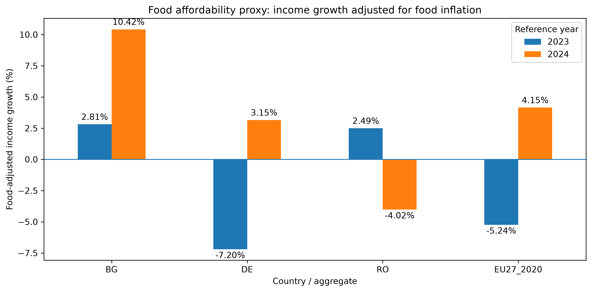
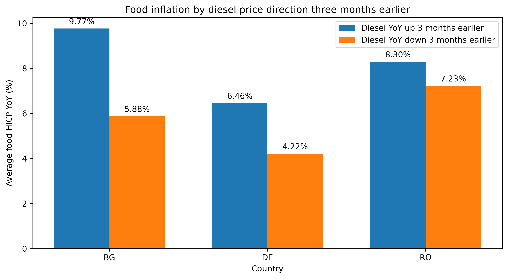

# European Food Affordability Analytics

**Food prices, incomes and purchasing power across Europe**

European Food Affordability Analytics is a Python, SQL and MariaDB data project that examines food-price dynamics and relative food affordability across selected European economies.

The project combines data from Eurostat, the Bulgarian National Statistical Institute (NSI), and the European Commission Weekly Oil Bulletin.

The current analysis focuses on:

- Bulgaria
- Germany
- Romania
- EU27 aggregate where methodologically appropriate

---

## Project goals

The project addresses four main questions:

1. How have food prices changed over time?
2. Has income growth kept pace with food-price growth?
3. How has the share of Bulgarian household expenditure spent on food changed over time?
4. Is there a descriptive lagged relationship between diesel-price changes and food inflation?

The project is designed both as:

- a data analytics / data engineering portfolio project;
- an applied research project demonstrating reproducible quantitative analysis.

---

## Technology stack

- Python 3.11
- pandas
- requests
- Matplotlib
- MariaDB
- SQL
- Jupyter Notebook
- python-dotenv

---

## Data sources

### Eurostat Food HICP

Dataset:

`prc_hicp_minr`

Food category:

`CP01 — Food and non-alcoholic beverages`

Unit:

`I25 — index, 2025 = 100`

Geographies:

- BG
- DE
- RO
- EU27_2020

The HICP series measures price-index dynamics and should not be interpreted as absolute food prices in euros.

---

### Eurostat income

Dataset:

`ilc_di03`

Indicator:

`MED_EI — Median equivalised income`

Unit:

`PPS`

Median equivalised net income in Purchasing Power Standards (PPS).

Geographies:

- BG
- DE
- RO
- EU27_2020

Available survey years:

- 2023
- 2024
- 2025

For the affordability analysis, the EU-SILC survey year is aligned with its income reference year:

- survey year 2023 → income reference year 2022
- survey year 2024 → income reference year 2023
- survey year 2025 → income reference year 2024

---

### Bulgarian National Statistical Institute

Source file:

`HH_2.2.3_BGN.xlsx`

Household expenditure data for Bulgaria are taken from the NSI household budget statistics.

The project tracks the share of monetary household expenditure allocated to:

**Food and non-alcoholic beverages**

Period:

`2008–2025`

This indicator is interpreted as a descriptive measure of household expenditure structure and not as a direct measure of welfare.

---

### European Commission Weekly Oil Bulletin

Source file:

`Weekly_Oil_Bulletin_Prices_History_maticni_4web.xlsx`

Worksheet:

`Prices with taxes`

Historical diesel prices are taken from the European Commission Weekly Oil Bulletin.

Original unit:

`EUR per 1000 litres`

Countries used in the diesel-food comparison:

- Bulgaria
- Germany
- Romania

Weekly observations are aggregated to monthly averages before analysis.

The European Commission `EU` aggregate is not directly matched with Eurostat `EU27_2020`, because the aggregate definitions are not assumed to be methodologically identical.

---

## Data pipeline

```text
Eurostat APIs / NSI Excel / European Commission Excel
                         ↓
                      Python
               requests + pandas
                         ↓
                 cleaning / validation
                         ↓
                      MariaDB
                         ↓
                    SQL analysis
                         ↓
                      pandas
                         ↓
                    Matplotlib
                         ↓
              interpretation / outputs

              ```

The project uses separate reusable Python pipeline modules for:

- food HICP;
- income;
- NSI household expenditure;
- diesel prices.

Database loads use UPSERT logic so pipelines can be re-run without creating duplicate records.

---

## Database tables

### `hicp_food_index`

Monthly food HICP observations.

### `income_pps`

Annual median equivalised income in PPS.

Primary key:

```text
(year, geo)
```

### `household_food_expenditure_share`

Bulgarian household food expenditure share.

Primary key:

```text
(year, geo)
```

### `diesel_prices`

Monthly average diesel prices.

Primary key:

```text
(month, geo)
```

---

## Food affordability methodology

Two complementary indicators are retained.

### Simple difference

```text
income growth (%) - food HICP growth (%)
```

This produces a difference in percentage points and is useful as a simple descriptive approximation.

### Food-adjusted income growth

The main ratio-based affordability proxy is:

```text
((1 + income growth) / (1 + food-price growth) - 1) × 100
```

This avoids treating two growth rates as directly additive.

The metric is named:

`food_adjusted_income_growth_pct`

It is a descriptive affordability proxy and should not be interpreted as an official measure of real purchasing power or household welfare.

---

## Affordability results

| Reference year | Geography | Income growth | Food HICP growth | Food-adjusted income growth |
|---|---|---:|---:|---:|
| 2023 | BG | 17.25% | 14.05% | 2.81% |
| 2023 | DE | 4.59% | 12.70% | -7.20% |
| 2023 | EU27_2020 | 6.74% | 12.65% | -5.24% |
| 2023 | RO | 17.49% | 14.63% | 2.49% |
| 2024 | BG | 13.49% | 2.78% | 10.42% |
| 2024 | DE | 5.57% | 2.34% | 3.15% |
| 2024 | EU27_2020 | 6.56% | 2.32% | 4.15% |
| 2024 | RO | -1.24% | 2.89% | -4.02% |

For Bulgaria, the proxy is positive in both available reference years and increases substantially in 2024.

This does not mean that food prices fell. It means that income growth exceeded food-price growth according to this specific indicator.



---

## Diesel and food inflation analysis

Monthly diesel-price YoY changes were compared with food HICP YoY inflation.

The analysis tested diesel-price changes at:

- lag 0;
- lag 1 month;
- lag 2 months;
- lag 3 months.

For the period used in the comparison, each country contributes 44 monthly observations.

Among the tested lags, the strongest positive linear association appears at a three-month lag:

| Geography | Lag-3 correlation |
|---|---:|
| BG | 0.331 |
| DE | 0.213 |
| RO | 0.378 |

A conditional comparison also shows higher average food HICP inflation when diesel YoY growth had been positive three months earlier:

| Geography | Diesel up | Diesel down | Difference |
|---|---:|---:|---:|
| BG | 9.77% | 5.88% | +3.89 pp |
| DE | 6.46% | 4.22% | +2.24 pp |
| RO | 8.30% | 7.23% | +1.07 pp |

These results indicate a descriptive lagged association only.

They do **not** establish that diesel-price changes cause changes in food prices.



---

## Bulgarian household expenditure

NSI data cover:

`2008–2025`

The share of monetary expenditure allocated to food and non-alcoholic beverages declines over much of the long-run period, although the series is not monotonic.

Examples:

- 2008: 34.9%
- 2024: 28.3%
- 2025: 29.1%

A declining food expenditure share may be consistent with a lower relative food burden, but it should not be interpreted independently as proof of higher household welfare.

---

## Interpretation and scientific context

Taken together, the project shows that food affordability cannot be assessed from food-price inflation alone.

For Bulgaria, the food-adjusted income-growth proxy is positive for both available reference years: 2.81% in 2023 and 10.42% in 2024. This indicates that income growth in PPS exceeded food-price growth according to this specific proxy. It does not imply that food prices fell, that households became proportionally wealthier, or that overall household welfare improved.

This interpretation is consistent with Pawlak et al. (2024), who analyse economic access to food in the EU using food prices, household income and broader food-security indicators. Their results show that income growth may offset food-price inflation while other indicators of household food insecurity can still deteriorate. Therefore, price and income comparisons alone do not provide a complete measure of household welfare or food security.

The diesel analysis provides exploratory evidence of delayed co-movement between energy costs and food inflation. Among the tested lags of 0–3 months, the strongest positive correlations occur at a three-month lag for Bulgaria, Germany and Romania. Average food HICP inflation is also higher in months preceded three months earlier by positive diesel-price YoY growth.

These findings are broadly consistent with Borrallo et al. (2026), who find significant and persistent transmission of food and energy commodity-price shocks to food inflation in the euro area, including asymmetric responses to price increases and decreases. However, their estimated transmission dynamics differ from this project and reach their maximum effect at around twelve months. The literature therefore supports the possibility of delayed and asymmetric transmission, but does not validate the specific three-month lag or correlation coefficients estimated here.

Finally, the Bulgarian household-expenditure series shows a long-run decline in the share of monetary expenditure allocated to food and non-alcoholic beverages, from 34.9% in 2008 to 29.1% in 2025, although the path is not monotonic.

Olipra (2024) shows that the relationship between income and the household food-expenditure share in Central and Eastern European economies can be non-linear. Food-expenditure shares may stabilise or even increase despite rising incomes. This supports interpreting the Bulgarian expenditure-share series as a descriptive indicator of household expenditure structure rather than direct evidence of changes in welfare.

Overall, the project provides descriptive evidence that the relationship between food prices and household economic conditions is shaped jointly by income growth, expenditure structure and cost-side pressures such as energy prices. The findings are broadly consistent with prior European research, but the project's lag estimates, correlations and affordability proxy should not be interpreted as causal estimates or externally validated parameters.

---

## Scientific literature

Borrallo, F., Cuadro-Sáez, L., Gras-Miralles, Á. and Perez, J.J. (2026) ‘The transmission of shocks to food and energy commodity prices to food inflation in the euro area’, *Applied Economics Letters*, 33(3), pp. 411–416. [https://doi.org/10.1080/13504851.2024.2369711](https://doi.org/10.1080/13504851.2024.2369711).

Olipra, J. (2024) ‘Does Engel’s law work in central and Eastern European countries? The role of aspirations in determining food expenditures’, *Structural Change and Economic Dynamics*, 71, pp. 26–34. [https://doi.org/10.1016/j.strueco.2024.06.005](https://doi.org/10.1016/j.strueco.2024.06.005).

Pawlak, K., Malak-Rawlikowska, A., Hamulczuk, M. and Skrzypczyk, M. (2024) ‘Has food security in the EU countries worsened during the COVID-19 pandemic? Analysis of physical and economic access to food’, *PLOS ONE*, 19(4), e0302072. [https://doi.org/10.1371/journal.pone.0302072](https://doi.org/10.1371/journal.pone.0302072).

## Visual outputs

Generated figures are stored in:

```text
outputs/figures/
```

Current outputs include:

```text
diesel_food_lag3_comparison.png
bg_diesel_food_timeseries.png
de_diesel_food_timeseries.png
ro_diesel_food_timeseries.png
food_adjusted_income_growth.png
```

---

## Project structure

```text
european_food_price_monitor/
│
├── data/
│   └── raw/
│       ├── ec_oil/
│       └── nsi/
│
├── notebooks/
│   ├── 01_food_prices.ipynb
│   ├── 02_income.ipynb
│   ├── 03_eurostat_discovery_demo.ipynb
│   ├── 04_nsi_household_budget.ipynb
│   └── 05_fuel_diesel.ipynb
│
├── outputs/
│   └── figures/
│
├── sql/
│   ├── schema.sql
│   └── analysis.sql
│
├── src/
│   ├── db.py
│   ├── hicp_pipeline.py
│   ├── income_pipeline.py
│   ├── nsi_pipeline.py
│   └── fuel_pipeline.py
│
├── .env   # local only, excluded from Git
├── .gitignore
├── requirements.txt
└── README.md
```

---

## Methodological limitations

The project is primarily descriptive and exploratory.

Important limitations include:

- HICP is an index and not an absolute euro food-price series.
- Income data and food-price data require careful temporal alignment.
- PPS income is not equivalent to disposable cash income.
- Household expenditure shares do not directly measure welfare.
- Correlation does not imply causation.
- Diesel prices are only one of many potential drivers of food inflation.
- The diesel lag analysis does not constitute a causal pass-through model.
- The EU aggregate from the Weekly Oil Bulletin is not assumed to be identical to Eurostat `EU27_2020`.

Potential drivers not explicitly modelled include:

- wages;
- electricity and gas prices;
- agricultural input costs;
- exchange rates;
- taxation;
- supply-chain disruptions;
- retailer margins;
- market structure.

---

## Reproducibility

Database credentials are stored in a local `.env` file and are excluded from version control.

Python database connections are handled through:

```text
src/db.py
```

Reusable pipeline scripts allow source data to be cleaned and loaded into MariaDB consistently.

SQL analytics are stored in:

```text
sql/analysis.sql
```

All five Jupyter notebooks were tested from a clean kernel using a full restart and Run All workflow.

---

## Status

The analytical MVP is complete and published as a reproducible portfolio project.